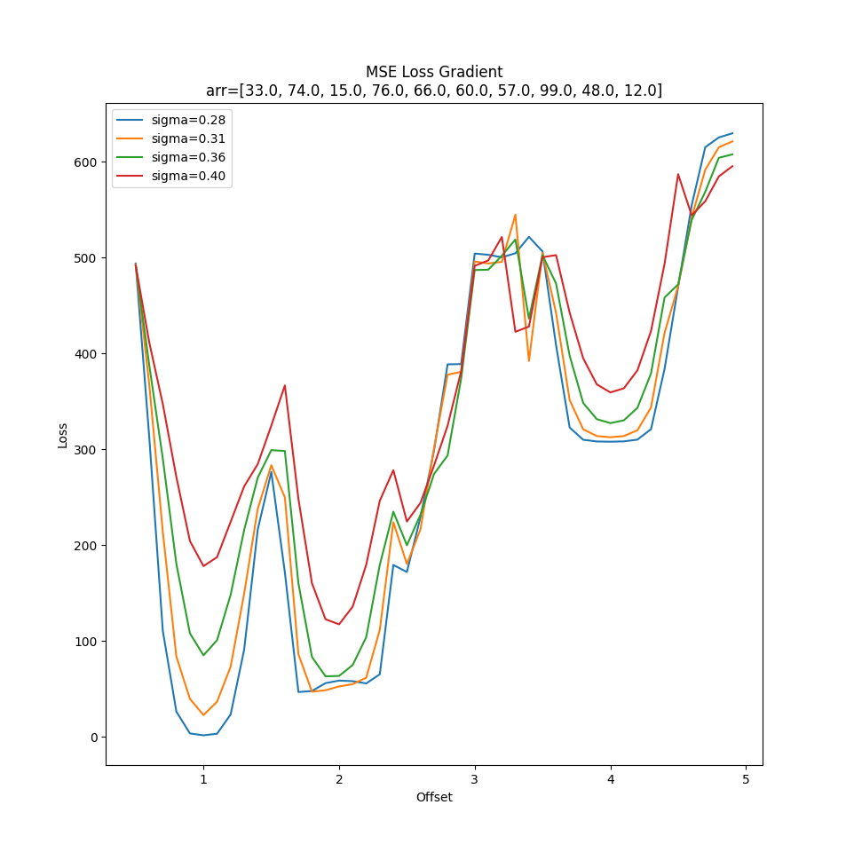

By: Decker Krogh

# Winter Quarter Writeup 

The goal of this document is to give an overview of what Razvan's
Differentiable Programming (DP) team worked on over the 2025 Winter Quarter.
Lots's of what we've worked on is taken directly out of chapters 4-6 from
Blondel.

## Bubble Sort 

In order to get our toes wet working with DP we started with implementing a
"soft" version of bubble sort, a simple sorting algorithm. Bubble sort works by
first comparing the first two elements in the array, swapping if necessary,
then the next two, then so until the end of the list. It does this again n
times until the entire list is sorted goes over the whole length like this
once, then again n times.

The first thing we must do in order to implement soft sorting is to create a
soft list implementation.

### Soft list

Let's say we have a normal list:

`l = [5, 10, 5, 8]`

If we access element `1` in this list we will get 10. If this is instead a soft
list, we would expect to get a value that's *close* to 10, but will be slightly
less because the surrounding elements are less than 10. To do this we apply a
gaussian weighting (imagine a bell curve) centered at the accessed element which
be used to output a value that's weighted across *all* the values in the list.

[Just brainstorming now: what if we only weighted across some n neighbors? Would that
work?]

What's nice about this is that we can access non-integer elements, which will
be necessary for differentiating during optimization. Let's say, for example,
that we have some program which should be accessing element 2 in a list but
instead it's accessing element 1. If we were using a normal list, we wouldn't
be able to use gradient descent methods because the error gradient will be a
step function.  By "smoothing" out the list, the error gradient will become
continuous and we can learn the correct parameter of 2 with SGD and take steps
1.1, 1.3, etc.

Check out `soft_list.py` in the repository for our implementation.

### Libraries

Just thought I should make a quick note on the libraries we're using. We started
last quarter with PyTorch, however we ended up switching to autograd. PyTorch
was working fine, however it's a very large library and if you ever want to
actually get into the nitty gritty on how it works, which is important for this
project, it's easy to get overwhelmed.
[HIPSautograd](https://github.com/HIPS/autograd) is a lightweight library
written to calculate the derivatives of python+numpy code. PyTorch has its own
module, this is essentially a minimal implementation of it.

### Loss functions

The last thing we need before we can differentiate our bubble sort is a loss
function. This was something we spent a while working on last quarter. The role
of the loss function is to creat a single loss which can be used to update all
the model's tunable parameters. Therefore, the more information the loss
function can encode, the better the model can do.

The simplest method is to use mean squared error (MSE), where you compare each
element in the soft-sorted array with the correctly sorted array. A more
advanced method would compare the *ranks* of the two lists rather than the
absolute numbers. We implemented
[this](https://www.microsoft.com/en-us/research/wp-content/uploads/2016/02/SoftRankWsdm08Submitted.pdf)
paper by Taylor which utilizes something called soft ranks.

### Bubble sort differentiation

At this point we can change our bubble sort to use the soft list functions.
This works just like normal bubble sort but it will return a list with floats
instead of integers. The floats should be very close to the true values of the
array.

The main differentiation experiment we did with bubble sort was to add an error
where instead of swapping values which are a distance of 1 next to each other,
it swaps with some other distance. The goal is that the algorithm is able to
perform gradient descent and end up with the correct value of 1. We call this
parameter the "offset".

There are two ways to perform this experiment:

1. Use a training paradigm where you train the model with autograd.
2. Just try out different values of the offset and plot the different loss
   values.

The second method is what I used to generate graphs, but the idea is that we're
learning how to create programs which are differentiable with autograd, so
we implemented method one as well.

### Results

Here is an example a loss graph generated with the second method:

The sigma value is a hyperparameter used to adjust how "wide" the gaussian
curve is for list access and setting.

As you can see, there is a global minima at 1, but just barely, and only for
values of sigma at 0.28 and 0.31. There is also a very large local minima at
2.0. This isn't good because what will happen is the offset will get stuck at
2.0 during training and not be able to reach the correct value of 1.0. This was
one of the main motivations for switching to the softrank loss function. 

### Note on coding paradigm

A functional programming works quite well with this type of work, especially
with autograd. I've avoided using classes so as not to hide any differentiable
functions in the form of methods.

### What's next? Two Pathways

We could continue working on bubble sort, however I don't think this will yield
too noteworthy a paper, and really it was a warmup exercise in DP.

One pathway: LLM coding. This would consist of "finetuning" LLM's based on
errors in generated code. This would require differentiating errors through the
code and back through the LLM's. The architecture for such a system is still up
in the air.

Another pathway: Crytanalysis. For this we would be attempting to find faults in
modern cryptographic hashing algorithms using DP techniques. In the 90's
*differential* methods were used to crack older hashing algorithms, however it
does not appear that anybody has used *differential programming.* It remains to
be seen whether we can apply DP to this problem.
